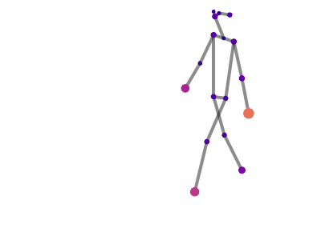
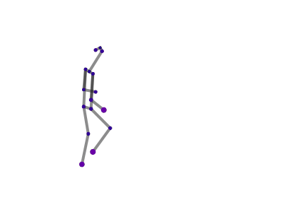

# GaitGraph2: Towards a Deeper Understanding of Skeleton-based Gait Recognition

Accepted at: [17th IEEE Computer Society Workshop on Biometrics 2022](https://www.vislab.ucr.edu/Biometrics2022/index.php) (CVPRW'22)

[](https://arxiv.org/abs/2204.07855)

_Previous version:_<br>
__GaitGraph: Graph Convolutional Network for Skeleton-Based Gait Recognition__ (ICIP'21)<br>
[](https://github.com/tteepe/GaitGraph)
[](https://doi.org/10.1109/ICIP42928.2021.9506717) 
[](https://arxiv.org/abs/2101.11228)

## Preparation
Clone the repository and install the dependencies from `requirements.txt`.

### Datasets
- CASIA-B: Download from [here](https://github.com/tteepe/GaitGraph/releases/tag/v0.1) and move `casia-b_pose_coco.csv` to `data`
- OUMVLP-Pose: Download from [here](http://www.am.sanken.osaka-u.ac.jp/BiometricDB/GaitLPPose.html)

### Pre-trained models
You can download pre-trained models from [here](https://github.com/tteepe/GaitGraph2/releases/tag/v0.1).

## Running the code
We use [PyTorch Lightning CLI](https://pytorch-lightning.readthedocs.io/en/stable/common/lightning_cli.html) for configuration and training.

Train:
```bash
# CASIA-B
python3 gaitgraph_casia_b.py fit --config configs/casia_b.yaml 
# OUMVLP-Pose (OpenPose)
python3 gaitgraph_oumvlp.py fit --config configs/oumvlp.yaml
# OUMVLP-Pose (AlphaPose)
python3 gaitgraph_oumvlp.py fit --config configs/oumvlp.yaml --data.keypoints alphapose
```

Test:
```bash
python3 gaitgraph_{casia_b,oumvlp}.py predict --config <path_to_config_file> --ckpt_path <path_to_checkpoint> --model.tta True
```

Logs and checkpoints will be saved to `lighting_logs` and can be shown in tensorboard with:
```bash
tensorboard --logdir lightning_logs
```

## Visualization of Activations
To run the visualization add run the following command:
```bash
python3 gaitgraph_{casia_b,oumvlp}.py predict --config <path_to_config_file> --ckpt_path <path_to_checkpoint> --config configs/draw.yaml --model.tta False
```
Examples:<br>



### Citation
If you use GaitGraph2, please use the following BibTeX entry.

```
@misc{teepe2022gaitgraph2,
  doi = {10.48550/ARXIV.2204.07855},
  url = {https://arxiv.org/abs/2204.07855},
  author = {Teepe, Torben and Gilg, Johannes and Herzog, Fabian and H\"ormann, Stefan and Rigoll, Gerhard},
  title = {Towards a Deeper Understanding of Skeleton-based Gait Recognition},
  publisher = {arXiv},
  year = {2022}
}
```
